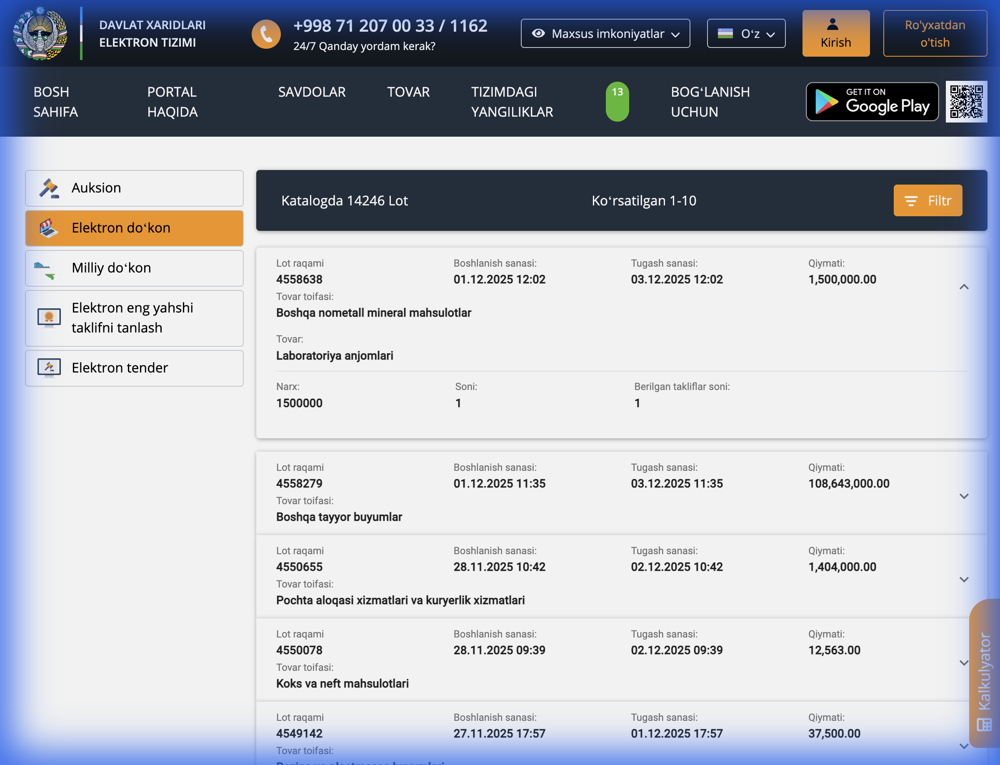

# UzEx Scraper

A robust, production-ready web scraper for the Uzbekistan Commodity Exchange (xarid.uzex.uz). This tool extracts detailed information from both **Completed Auctions** and **Shop Deals**.

## 📂 Project Structure

```
uzex/
├── scraper/
│   ├── api_client.py       # Main scraping logic using direct API calls
│   ├── models.py           # Pydantic models for data validation and schema definition
│   ├── dynamic_scraper.py  # Playwright-based scraper for interception and dynamic content
│   ├── audit_scraper.py    # Script to audit API data against models
│   └── test_full_scraper.py# Integration test for the entire scraping flow
├── data/
│   └── raw/                # Directory where scraped JSON data is saved
├── docs/
│   └── images/             # Screenshots for documentation
├── Dockerfile              # Container configuration for production deployment
└── requirements.txt        # Python dependencies
```

## 🛠 Code Explanation

### 1. `api_client.py` (The Core)
**Why used?**
Instead of slow and brittle HTML parsing (using Selenium/Playwright for everything), we reverse-engineered the site's internal API. This allows us to:
- **Speed**: Fetch thousands of records in seconds.
- **Reliability**: APIs change less often than HTML layout.
- **Data Quality**: Get raw, structured JSON data directly from the server.

**Key Features:**
- `get_auctions()`: Fetches list of completed auctions.
- `get_auction_products(lot_id)`: Fetches detailed product list for a specific auction.
- `get_shop_deals()`: Fetches list of shop deals.
- `get_shop_products(lot_id)`: **Clever Hack**: Shop deals don't have a dedicated "details" endpoint. We discovered that using the list endpoint (`GetNotCompletedDeals`) with a `lot_id` filter returns the specific deal details.

### 2. `models.py` (Data Integrity)
**Why used?**
We use **Pydantic** to define strict data schemas (`AuctionDeal`, `ShopDeal`, `DealProduct`).
- **Validation**: Ensures scraped data matches expected types (e.g., prices are floats, dates are datetimes).
- **Consistency**: Guarantees that the output JSON is always structured correctly for downstream analytics.

### 3. `dynamic_scraper.py` (The Fallback)
**Why used?**
Some sites use complex anti-bot protections or dynamic tokens. This script uses **Playwright** (a headless browser) to:
- **Intercept Traffic**: It loads the real website and captures the JSON responses sent to the browser.
- **Debug**: Useful for finding new API endpoints or payload structures if they change.

## 🛡 Site Protection Analysis

The site (`xarid.uzex.uz`) is a modern Single Page Application (SPA) built with Angular.

### Challenges & Solutions
1.  **Dynamic Content**: The site loads data via JavaScript. Standard `requests` or `BeautifulSoup` would see an empty page.
    -   **Solution**: We identified the backend API endpoints (`xarid-api-auction.uzex.uz` and `xarid-api-shop.uzex.uz`) and call them directly.
2.  **Hidden Endpoints**: Shop details were not obvious.
    -   **Solution**: By analyzing network traffic, we found that the "list" endpoint accepts a `lot_id` filter, effectively acting as a "details" endpoint.
3.  **Anti-Bot**: The site does **not** currently employ aggressive anti-bot measures like Cloudflare Turnstile or CAPTCHAs on these public API endpoints. Standard User-Agent headers are sufficient.

## 📸 Screenshots

### Auction Details
*Successfully scraped detailed product lists including specifications.*


### Shop Details
*Successfully extracted single-item shop deal information.*


### 3. High-Performance Scrapy System (New)
**Why used?**
For scraping the entire dataset (200k+ records), we implemented a **Scrapy + PostgreSQL** architecture.
-   **Async**: Handles 50+ concurrent requests.
-   **Database**: Stores data in a structured SQL database instead of thousands of JSON files.
-   **Resilient**: Automatically handles retries and errors.

## 🚀 Deployment

### Option A: High-Performance Scrapy (Recommended)

1.  **Start the Database and Scraper:**
    ```bash
    docker-compose up -d
    ```

2.  **Run the Spiders:**
    ```bash
    # Enter the container
    docker-compose exec scraper bash

    # Run Auction Spider
    scrapy crawl auctions

    # Run Shop Spider
    scrapy crawl shops
    ```
    *Data will be saved to the `uzex_db` PostgreSQL database.*

### Option B: Simple Script (Legacy)

1.  **Build the image:**
    ```bash
    docker build -t uzex-scraper .
    ```

2.  **Run the script:**
    ```bash
    docker run -v $(pwd)/data:/app/data uzex-scraper python scraper/test_full_scraper.py
    ```

